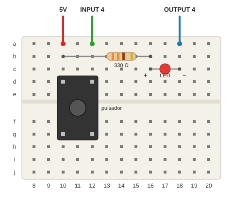

# Lección 05: Botones

Un botón es una **entrada**: el programa lo lee y decide qué hacer con `if`. Además, montamos nuestro primer
circuito en una protoboard: un pulsador y un LED con su resistencia. **No mueve los motores.**

## Qué aprende

* **Entradas y salidas digitales.** Una entrada digital solo tiene dos valores: alto (`High`, 5 V, pulsado) o bajo
  (`Low`, 0 V, suelto). Una salida digital también: encendida o apagada.
* **Decidir con `if` y `else`** según lo que lee una entrada.
* **Un método que devuelve un valor:** `IsPressed()` devuelve `true` si el botón está pulsado.
* **Contar cambios, no estados.** Para contar pulsaciones, el programa recuerda cómo estaba el botón antes
  (`wasPressed`) y solo cuenta cuando pasa de suelto a pulsado.
* **Electrónica:** la protoboard, el pulsador, el LED y para qué sirve la resistencia.

## Material

* Una protoboard.
* Un pulsador de 12 mm.
* Un LED (rojo o amarillo) y una resistencia de 330 Ω (bandas naranja, naranja y marrón).
* 3 cables dupont macho-macho.

## Montaje

> ⚠️ Apaga el robot antes de montar el circuito: `sudo poweroff`, espera a que el LED verde de la Pi deje de
> parpadear y pon el interruptor de la UPS en OFF.

1. **Pulsador:** cruzando la ranura central, con las patas en **d10, g10, d12 y g12**. Solo entra en una posición.
2. **5V:** un cable desde un agujero libre de la fila de 5V (en la protoboard pequeña del HAT) hasta **a10**.
3. **IN4:** un cable desde el pin **INPUT 4** del HAT hasta **a12**.
4. **Resistencia de 330 Ω:** de **b10** a **b16**. No tiene sentido: se pone igual en las dos direcciones.
5. **LED:** pata larga (ánodo, +) en **c16** y pata corta (cátodo, −) en **c18**.
6. **OUT4:** un cable desde el pin **OUTPUT 4** del HAT hasta **a18**.

### Cómo es una protoboard por dentro

Debajo de los agujeros hay tiras de metal. En cada fila, los agujeros **a–e** están unidos entre sí, y los
**f–j** también; la ranura central separa los dos grupos. Todo lo que se pincha en la misma fila queda conectado.
Las líneas de los lados (+ roja y − azul) están unidas a lo largo, y sirven para repartir 5V y GND.

### El pulsador

Tiene 4 patas, pero solo 2 contactos: las patas que cruzan la ranura están unidas por dentro. Al pulsar, el botón
une la fila 10 (5V) con la fila 12 (IN4), y la entrada lee 5 V. Si lo giras, parece que está siempre pulsado.

Con el botón suelto, la entrada no está unida a nada. Una entrada así puede leer valores al azar, y por eso se
suele añadir una resistencia de **pull-down** (por ejemplo, de 10 kΩ) entre la entrada y GND. Las entradas del
Explorer HAT ya la llevan por dentro: con el botón suelto, IN4 lee siempre 0.

### El LED y su resistencia

Un LED (diodo emisor de luz) solo deja pasar la corriente en un sentido: del ánodo (pata larga) al cátodo (pata
corta). Al revés no se enciende, pero tampoco se rompe.

Un LED no limita su corriente: conectado a 5 V sin nada más, pasaría tanta que se quemaría. La resistencia la
limita. Es la **ley de Ohm**: corriente = tensión / resistencia. El LED rojo se queda unos 2 V, así que la
resistencia recibe los 3 V que faltan hasta 5 V: 3 V / 330 Ω ≈ 0,009 A, es decir, 9 mA. Es una corriente segura
para el LED y se ve bien.

### La salida OUT4

Las salidas del Explorer HAT no dan 5 V: dentro tienen un transistor que funciona como un interruptor a GND.
Cuando el programa activa OUT4 (`PinValue.High`), el interruptor se cierra y la corriente va de 5V a la
resistencia, al LED y a GND a través de OUT4. El LED se enciende.

## Qué hace

1. **Parte 1 (10 s):** la luz roja del robot y nuestro LED se encienden mientras pulsas el botón.
2. **Parte 2 (10 s):** cuenta las pulsaciones y escribe el total.
3. **Parte 3:** nuestro LED parpadea una vez por cada pulsación.

El programa lee el botón cada `checkTime` (20 ms): 50 veces por segundo, mucho más rápido que un dedo.

## Los rebotes

Un pulsador tiene dos piezas de metal que se tocan. Al pulsar o al soltar, a veces rebotan unas cuantas veces en
menos de un milisegundo, como una pelota. Si el programa lee el botón justo durante esos rebotes, puede contar una
pulsación varias veces.

Nosotros lo medimos: con `checkTime` a 1 ms y el tiempo entre pulsaciones en la pantalla, la pulsación más rápida
llegó a los 475 ms de la anterior. No hubo ningún rebote. Con otros pulsadores puede haberlos. Leer el botón
cada 20 ms los evita casi siempre: los rebotes terminan antes de la lectura siguiente.

## Si lo paras con Ctrl+C

`SafeExplorerHat` apaga las luces del robot, pero no conoce nuestro LED. Si se queda encendido, ejecuta
`bash tools/parar-robot.sh`, que también apaga OUT4.

## Retos

* **Al revés.** Que el LED esté encendido y se apague al pulsar.
* **Interruptor.** Cada pulsación cambia el LED: una lo enciende y la siguiente lo apaga.
* **Semáforo para peatones.** Al pulsar, el semáforo de la lección 02 pasa a rojo para los coches.
* **Arranca el robot.** Espera a que pulsen el botón y después dibuja el cuadrado de la lección 04 (con las ruedas
  en el aire la primera vez).
* **Juego de reflejos.** El LED se enciende después de un tiempo al azar (`Random.Shared.Next(1000, 5000)`), y el
  programa mide cuánto tardas en pulsar (`Stopwatch`, como en la lección 06).
* **Dos LED.** Monta el LED amarillo con otra resistencia. ¿Qué salida libre puedes usar? (Pista: ninguna; OUT1 a
  OUT3 son de los sensores. Tendrás que encender los dos LED a la vez desde OUT4: ponlos en paralelo, cada uno con su
  resistencia.)
