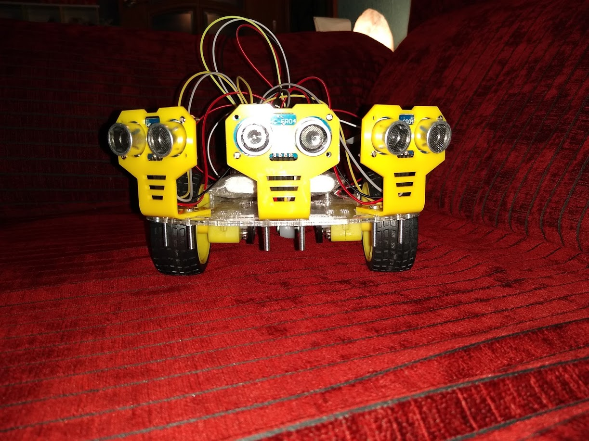
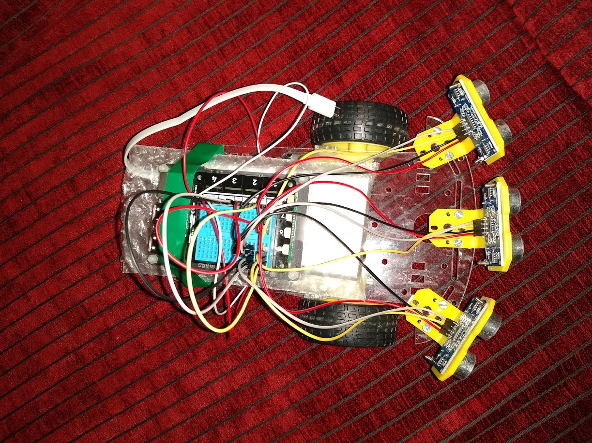
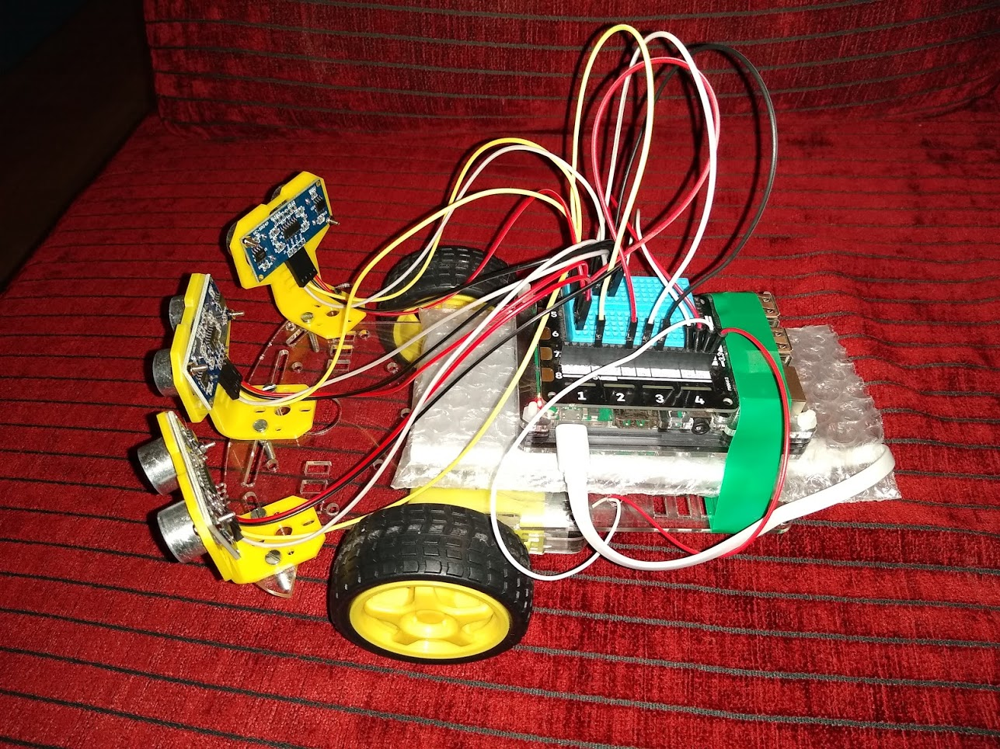

# Robot que esquiva obstáculos (ObstacleAvoidance)

Robot autónomo con tres sensores de ultrasonidos HC-SR04P. Avanza, frena al acercarse a un obstáculo, retrocede,
gira hacia el lado con más sitio y sigue. **Mueve los motores.**





## Qué hardware usa

* **Motores:** motor 1 = GPIO 19 / 20; motor 2 = GPIO 21 / 26. El motor `One` es la **rueda derecha** y `Two`
  la **izquierda**.
* **Luces** (`Lights.One` a `Lights.Four`): azul (GPIO 4), amarilla (17), roja (27) y verde (5). Indican lo cerca
  que está el obstáculo.
* **Sensores HC-SR04:**

  | Sensor    | TRIG            | ECHO           |
  |-----------|-----------------|----------------|
  | Izquierda | OUT3 (GPIO 13)  | IN3 (GPIO 24)  |
  | Centro    | OUT1 (GPIO 6)   | IN1 (GPIO 23)  |
  | Derecha   | OUT2 (GPIO 12)  | IN2 (GPIO 22)  |

  Quedan libres OUT4 (GPIO 16) e IN4 (GPIO 25).
* **Alimentación:** la Waveshare UPS HAT (B) es la fuente probada. Con baterías externas USB hay bajadas de
  tensión al mover los motores (comparativa en la Fase 2 de `PLAN.md`).

Antes de probar el robot, comprueba los sensores con [`ExplorerHat.SonarDashboard`](../ExplorerHat.SonarDashboard/README.md).

## Avisos de seguridad

> ⚠️ **Prueba siempre con las ruedas en el aire** la primera vez y cada vez que cambies el código.
> En el suelo, deja espacio libre y vigila el robot.

* **Para pararlo:** pulsa cualquier tecla. El robot termina la maniobra en curso, para los motores, apaga las
  luces, libera los pines y sale.
* **Parada de emergencia:** **Ctrl+C** (o cerrar la sesión SSH). `SafeExplorerHat` para los motores antes de
  salir. Si un depurador lo detiene, los motores se quedan como estuvieran (parados o a toda velocidad):
  usa la tarea *Parar el robot* de VS Code o `bash tools/parar-robot.sh` en la Pi.
* Los sensores no ven los obstáculos pequeños, blandos o en ángulo, ni los que están a los lados o detrás.
  El robot puede chocar.

## Cómo ejecutarlo

El programa **lee el teclado** (`Console.ReadKey`). Lánzalo desde una terminal: no funciona sin terminal
ni con el depurador.

**En la Raspberry Pi** (terminal SSH o con pantalla):

```bash
dotnet run --project src/ExplorerHat.ObstacleAvoidance/ExplorerHat.ObstacleAvoidance.csproj
```

**Desde el PC con VS Code:** `Terminal > Run Task... > Ejecutar en la Pi` y elige `ExplorerHat.ObstacleAvoidance`.
Para depurarlo, ver *Adjuntar a un programa en la Pi* en el [README del repositorio](../../README.md).

Al arrancar, el programa pide una tecla:

* **N** (arranque normal): los motores arrancan de golpe a toda potencia.
* **S** (arranque suave): los motores arrancan y frenan poco a poco.

Cualquier otra tecla se ignora. Después escribe `Hit any key again to stop`. Pulsa una tecla para parar.
Si ocurre un error, el robot se para, pero el programa sigue esperando la tecla: púlsala para salir.

La consola muestra muchos mensajes (nivel `Debug` de Serilog): las lecturas, las decisiones y las maniobras.

## Cómo decide

### Los sensores

Un hilo de `Sonar` mide los tres sensores uno detrás de otro (centro, izquierda, derecha), con una pausa de
60 ms entre ellos para que el eco de uno no llegue al siguiente. Un ciclo completo dura unos 0,2 s.

### Filtro de lecturas falsas

A veces un HC-SR04 pierde el eco del obstáculo y mide la pared de detrás: da un salto a una distancia
mucho mayor. Es peligroso, porque el robot creería que el camino está libre.

* `DistanceSensor` hace una sola lectura por medida con `TryGetDistance`. Si no hay eco, cuenta 400 cm.
* Su distancia es **la más cercana de las dos últimas lecturas**. Un salto aislado se ignora sin retraso
  cuando el obstáculo se acerca. Cuando el obstáculo se aleja, solo hay que esperar una lectura más.
* No filtra dos saltos seguidos.

### Esperar lecturas nuevas

`Sonar.WaitForNewReadings()` espera a tener **dos lecturas nuevas de cada sensor**, hasta 2 segundos como
máximo. El robot la usa al arrancar, antes de elegir el lado del giro y después de cada paso del giro.
Así decide con medidas tomadas después de la maniobra, con el robot parado.

### Bucle principal

Cada 0,2 s toma la distancia **más pequeña** de los tres sensores y elige:

| Distancia mínima | Velocidad de los motores | Luces encendidas |
|---|---|---|
| 110 cm o más | 95 % | ninguna |
| de 80 a 110 cm | 90 % | 1 |
| de 50 a 80 cm | 85 % | 2 |
| de 30 a 50 cm | 80 % | 3 |
| menos de 30 cm (umbral `OBSTACLE_DISTANCE`) | maniobra de esquiva | 4 |

### Maniobra de esquiva

1. Frena (`SlowDown`) y espera 100 ms antes de cambiar el sentido de los motores, para que no tiren tanta corriente.
2. Retrocede 0,25 s al 85 % y frena otra vez.
3. Espera lecturas nuevas y elige el lado: gira a la **derecha** si la izquierda está más cerca o igual
   (`One` hacia atrás, `Two` hacia delante); si no, a la izquierda.
4. **Giro a pasos:** gira 150 ms (`TURN_STEP_TIME`), se para, espera lecturas nuevas y repite mientras
   haya algo a menos de 30 cm delante o en el lado del que se aleja. Con el robot parado al medir, no gira de más.
5. Si pulsas una tecla durante el giro, para y no vuelve a avanzar.
6. Si al acabar sigue habiendo un obstáculo cerca, repite la maniobra. Si no, vuelve a avanzar.

### Arranque normal o suave

* `SpeedUp` lleva los motores a la velocidad pedida. Con **N** lo hace de golpe. Con **S** lo hace en 4 pasos
  de 75 ms.
* `SlowDown` frena. Con **N** para de golpe. Con **S** baja en 3 pasos de 75 ms y después para.
* Los pasos del giro siempre arrancan y paran de golpe: son demasiado cortos.

Con **S**, las frenadas son suaves y el robot no levanta la rueda trasera. El arranque suave no evita las
bajadas de tensión con baterías USB; con la UPS HAT (B) no hay bajadas en ningún modo.

## Ideas para el taller

* Cambia `OBSTACLE_DISTANCE` (por ejemplo, de `30d` a `40d`): el robot esquiva antes.
* Cambia las velocidades `FLL_POWER`, `HGH_POWER`, `MDM_POWER` y `LOW_POWER`. Si bajan mucho, los motores
  no tienen fuerza para moverse en el suelo.
* Cambia `TURN_STEP_TIME` y mira cómo cambia el número de pasos del giro.
* Cambia cuánto retrocede (`TimeSpan.FromSeconds(0.25)`).
* Elige otro criterio para el lado del giro (ahora, `LeftDistance <= RightDistance`).
* Con las ruedas en el aire, pon la mano delante de cada sensor. Mira las luces y los mensajes.
